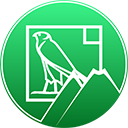

RVS_ONVIF
=
This project is a low-level [ONVIF](https://onvif.org) "driver" for Cocoa (Apple's [MacOS](https://www.apple.com/macos), [iOS](https://www.apple.com/ios) and [tvOS](https://www.apple.com/tvos)).

WARNING: THIS IS A WORK IN PROGRESS!
-
RVS_ONVIF is a large-scale project that is still very much under development. It does not yet have full support for the ONVIF Core profile, and there's still a lot of work to do on the S profile (for example, supporting PTZ).

That said, it has been tested on cameras from a number of different manufacturers, and is designed to be completely "manufacturer-agnostic." There's a lot of "leeway" built into the driver, and it works well with the current functionality.

It works, and it works now; just not at 100% of planned functionality. What has been done already, works.

HANDLES ONVIF-COMPLIANT NETWORKED DEVICES
-
The RVS_ONVIF driver has been developed primarily to access and control networked video surveillance cameras, but there is no reason that it can't be applied to other types of ONVIF-compliant devices.

The devices must be connected via TCP/IP to a network accessible by the device used to instantiate and control the driver.

NOT A DEVICE DRIVER 
-
RVS_ONVIF is a low-level native Swift (Apple) driver. It is not a "device driver," which usually sit at an operating system level (kernel or user space). It is designed to translate between an IP connection to a device, and a user application; presenting an object model of the ONVIF device.

DOES NOT DO DEVICE DISCOVERY
-
The driver is not designed to do ONVIF device discovery. That's a separate process that can be done at a different level from the driver. The driver expects to be supplied an IP address and a TCP port for the device upon instantiation.

DOES NOT DIRECTLY HANDLE VIDEO
-
The driver does not handle video directly. It allows access to the various video parameters (including the RTSP URIs), but users of the driver are expected to take the streaming URI, and connect it directly with the video consumer, in peer-to-peer fashion.

MULTI-OPERATING SYSTEM
-
RVS_ONVIF is designed to support [iOS](https://apple.com/ios)/[ipadOS](https://apple.com/ipados), [macOS](https://apple.com/ios), and [tvOS](https://apple.com/ios). There are test harnesses for all of these operating systems.

BASIC STRUCTURE
-
The project uses a "hub and spokes" structure, with a central "engine," and adapters for the various profiles.

DISPATCHERS
-
The driver uses a "Dispatcher" pattern, similar to Apple's Delegate pattern, but with a couple of differences:

1) You can have more than one "delegate." We call them "Dispatchers." The approach is more like registering for observer notifications than the "one only" registration that the Delegate pattern uses, but with the back-and-forth that the Delegate pattern prescribes. Each Dispatcher talks to the driver. It is not a one-way conversation.
2) Each "Dispatcher" prescribes a protocol (not a class, like a delegate) that extends a central one.

The messages that each profile handler/dispatcher wrks with are an "opaque" enum. We play some games to allow each dispatcher to add its own commands to the "smart" enum declared by the the central "hub."

IMPLEMENTATION
-
In order to use this, you need to create one instance of the driver per device connection. The driver will handle interactions with that device. You can instantiate more than one instance of RVS_ONVIF.

DEPENDENCIES
=
BUILD DEPENDENCIES
-
For testing, we depend upon [SWXMLHash](https://github.com/drmohundro/SWXMLHash), written by [David Mohundro](https://mohundro.com/) to parse mock XML data.
***NOTE:** For whatever reason, the CocoaPods project sets the Swift version of the SWXMLHash project to 3.0. Set it to 5. It will work*.
For code LINTing, we use [SwiftLint](https://github.com/realm/SwiftLint), written by the fine folks at [Realm.io](https://realm.io/).
For video display in our test harneses, we depend on variations of [VLCKit](https://code.videolan.org/videolan/VLCKit), written and maintained by the team at [VideoLAN](https://www.videolan.org/).

We use [Carthage](https://github.com/Carthage/Carthage) to include the VLCKit variants, and [CocoaPods](https://cocoapods.org) to include SwiftLint.

RUNTIME DEPENDENCIES
-
We use [SOAPEngine](https://github.com/priore/SOAPEngine) written and maintained by [the Priore Group](https://www.prioregroup.com) for dealing with the low-level SOAP wrapper.

SOAPEngine is directly copied and embedded in the project. It is not a submodule.

If you want to use RVS_ONVIF on devices, then you must [obtain a license for SOAPEngine](https://github.com/priore/SOAPEngine/blob/master/README.md#licenses) from Priore Group.

NOTE ABOUT TESTING:
-
We directly include the unit tests, as opposed to building the modules, because we are using completely generic tests, applied to all three platforms, so we don't want to deal with any conditional import weirdness.

LICENSE
-
© Copyright 2019, [The Great Rift Valley Software Company](https://riftvalleysoftware.com)

[MIT License](https://opensource.org/licenses/MIT)

Permission is hereby granted, free of charge, to any person obtaining a copy of this software and associated documentation
files (the "Software"), to deal in the Software without restriction, including without limitation the rights to use, copy,
modify, merge, publish, distribute, sublicense, and/or sell copies of the Software, and to permit persons to whom the
Software is furnished to do so, subject to the following conditions:

The above copyright notice and this permission notice shall be included in all copies or substantial portions of the Software.

THE SOFTWARE IS PROVIDED "AS IS", WITHOUT WARRANTY OF ANY KIND, EXPRESS OR IMPLIED, INCLUDING BUT NOT LIMITED TO THE WARRANTIES
OF MERCHANTABILITY, FITNESS FOR A PARTICULAR PURPOSE AND NONINFRINGEMENT.
IN NO EVENT SHALL THE AUTHORS OR COPYRIGHT HOLDERS BE LIABLE FOR ANY CLAIM, DAMAGES OR OTHER LIABILITY, WHETHER IN AN ACTION OF
CONTRACT, TORT OR OTHERWISE, ARISING FROM, OUT OF OR IN CONNECTION WITH THE SOFTWARE OR THE USE OR OTHER DEALINGS IN THE SOFTWARE.
